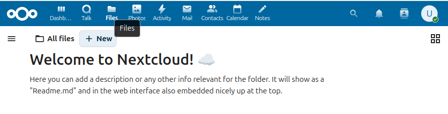
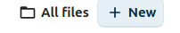
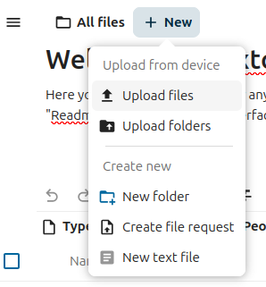
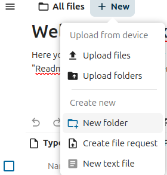
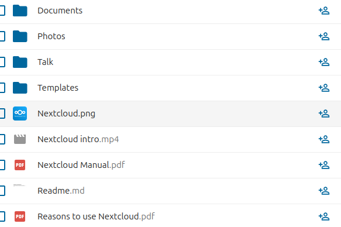
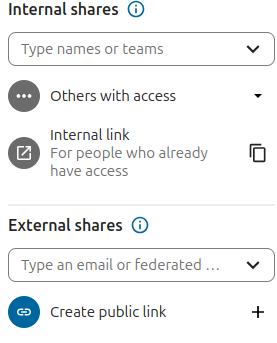
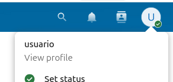
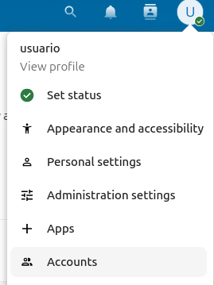

# Manual d'instal·lació d’ownCloud amb virtualització mitjançant IsardVDI

# Demostració del funcionament

## Pujar un Arxiu
#### Primerament hem d'anar a la part de "Arxius" de NextCloud, que en anglés seria "Files"



#### Seguidament li donem al boto on diu "Nou" o en anglés que seria "New"



#### Després fem click a "Penjar Fitxer" o "Upload Files"


## Crear una carpeta
#### Al mateix apartat  on pujem un fitxer, li donem a "New Folder" o "Nova Carpeta"



## Compartició de continguts
Per poder compartir els continguts hen de trobar l'icone blau de compartir que seria el de la imatge seguent:



Quan li donem a aquest botó, ens sortira dues maneres de compartir el contingut:
- "internal Shares": Seria per compartir amb persones que ja tinguin acces a aqust contingut.
- "External Shares": Seria per donar acces al contingut, ja sigui amb email o per un link.



## Creació d'usuaris
#### Per começar a crear altres usuaris, hem de donar-li al nostre perfil



#### Seguidament hen de fer click en "Accounts" o "Comptes"



## Configuració d’usuaris
### Per crear els usuaris ves a la part d'adalt on diu "Nova Compta" o "New account":


### Per crear els grups has d'anara a la part on diu "Groups" o "Grups" i donar-li al botó "+"


### Crea els 3 usuaris necesaris:

   - Usuari: **Administrador** → assignat al **grup Admin**.


   - Usuari: **Editor** → assignat al **grup Editors**.


   - Usuari: **Visualitzador** → assignat al **grup Visualitzadors**.  


## Assignació de rols i permisos
- **Administrador**: pot crear, editar, eliminar i compartir fitxers.  
- **Editor**: pot crear i modificar fitxers, però no eliminar carpetes compartides ni gestionar usuaris.  
- **Visualitzador**: només pot obrir i llegir fitxers, sense editar ni eliminar.  

### Demostració
- Iniciant sessió com *Visualitzador*, no apareixen opcions d’edició.  
- Iniciant sessió com *Editor*, es poden modificar documents però no eliminar-los si no són propis.  


## Administració d’arxius
### Jerarquia de carpetes
- `Documents_Personals` → privats per cada usuari.  
- `Treballs_Compartits` → Editors i Administradors.  
- `Recursos` → tots els usuaris, inclosos Visualitzadors.  

### Polítiques de seguretat
- Caducitat d’enllaços compartits (ex. 7 dies).  
- Contrasenya obligatòria per a enllaços externs.  
- Bloqueig de descàrregues per a Visualitzadors.  


## Accés des d’una màquina de la xarxa
1. Configura la màquina virtual amb una IP fixa.  
2. Des d’un altre dispositiu de la mateixa xarxa, accedeix via navegador:  

```bash
http://IP_de_la_VM/nextcloud


