# Manual d'instal·lació d’ownCloud amb virtualització mitjançant IsardVDI

# Demostració del funcionament

## Pujar un Arxiu
#### Primerament hem d'anar a la part de "Arxius" de NextCloud, que en anglés seria "Files"

#### Seguidament li donem al boto on diu "Nou" o en anglés que seria "New"

#### Després fem click a "Penjar Fitxer" o "Upload Files"

## Crear una carpeta
#### Al mateix apartat  on pujem un fitxer, li donem a "New Folder" o "Nova Carpeta"

## Compartició de continguts
Per poder compartir els continguts hen de trobar l'icone blau de compartir que seria el de la imatge seguent:

Quan li donem a aquest botó, ens sortira dues maneres de compartir el contingut:
- "internal Shares": Seria per compartir amb persones que ja tinguin acces a aqust contingut.
- "External Shares": Seria per donar acces al contingut, ja sigui amb email o per un link.

## Creació d'usuaris
#### Per começar a crear altres usuaris, hem de donar-li al nostre perfil

#### Seguidament hen de fer click en "Accounts" o "Comptes"

## Configuració d’usuaris
### Per crear els usuaris ves a la part d'adalt on diu "Nova Compta" o "New account":

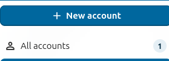

### Per crear els grups has d'anara a la part on diu "Groups" o "Grups" i donar-li al botó "+"

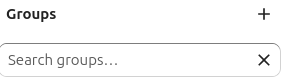

### Crea els 3 usuaris necesaris:
#### - **Primer crea els Grups: "Admin" "Editor" "Visualitzadors"**

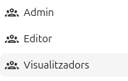

   - Usuari: **Administrador** → assignat al **grup Admin**.

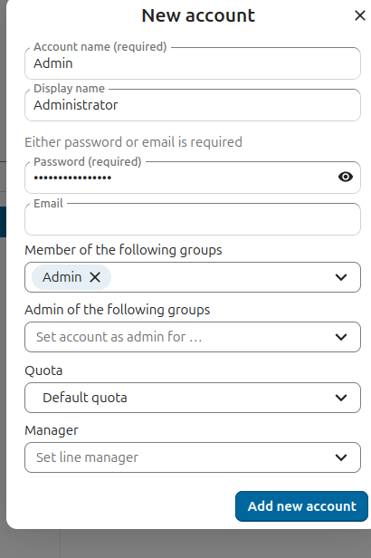

   - Usuari: **Editor** → assignat al **grup Editors**.

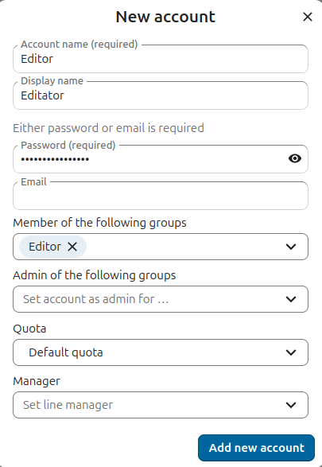

   - Usuari: **Visualitzador** → assignat al **grup Visualitzadors**.  

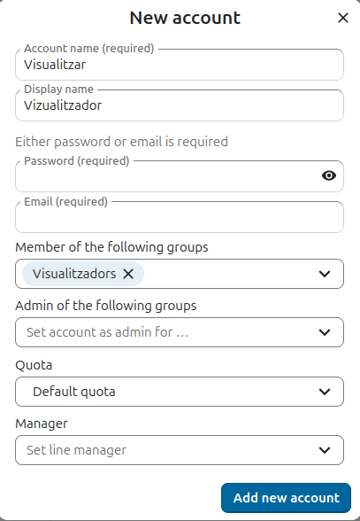

## Assignació de rols i permisos
### En aquest punt, com ja hem fet els grups i hem posat les comptes a cada grup, llavors cada compta ja te els seus propis rols.

- **Administrador**: pot crear, editar, eliminar i compartir fitxers.  
- **Editor**: pot crear i modificar fitxers, però no eliminar carpetes compartides ni gestionar usuaris.  
- **Visualitzador**: només pot obrir i llegir fitxers, sense editar ni eliminar.  

### Demostració
- Des de la compta principal, crea una carpeta per fer la prova, seguidament comparteix la carpeta amb les 3 comptes que vam crear.
  
- Seguidament crea un arxiu on pots posar el que vulguis ja que és una prova.

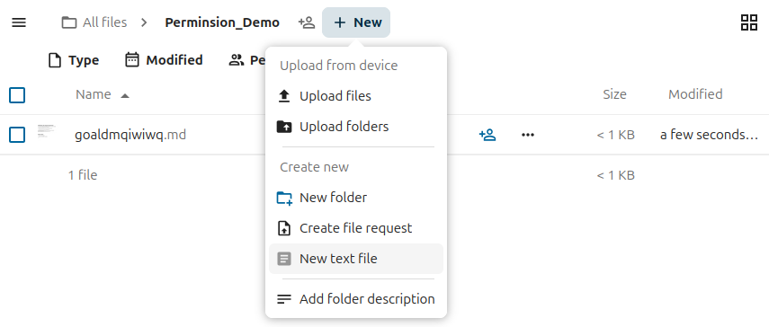

#### Administrador
- Primerament la farem amb la compta Admin, on posarem "Custom permisions" i posem totes les opcions que posen a la part de "Custom permissions"

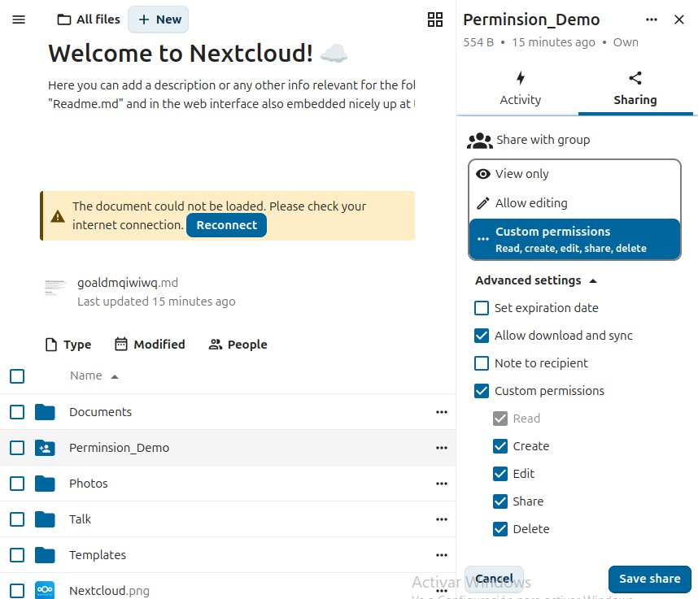

- Seguidament veiem a la part de "Files", la carpeta que vam compartir i veuras que pots fer tot.

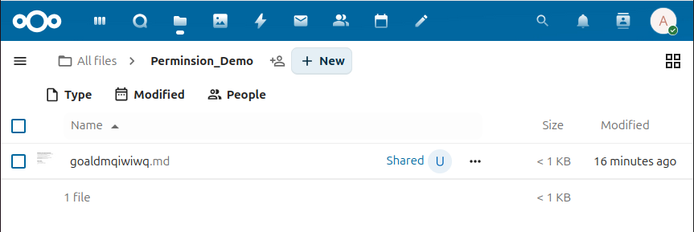

#### Visualitzador 
- Primerament la farem amb la compta visualitzador, on posarem "View Only"

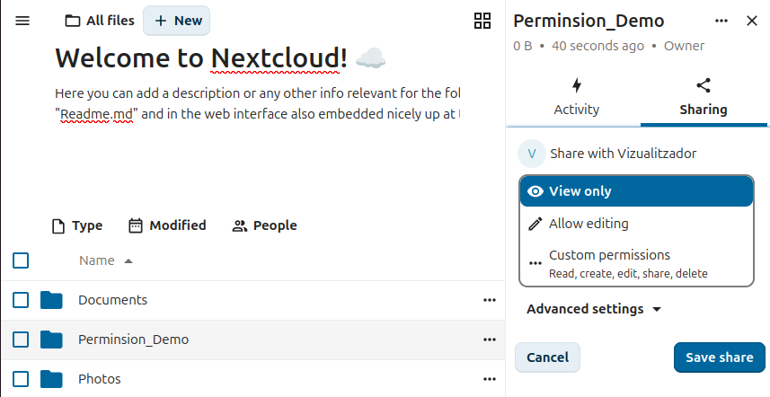

- Seguidament iniciem sessió com *Visualitzador*
- Seguidament veiem a la part de "Files", la carpeta que vam compartir i veuras que només la pots veure
  
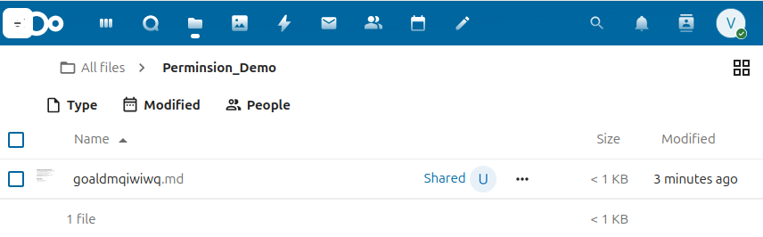

#### Editor
- Primerament la farem amb la compta Editor, on posarem "Allow editing"

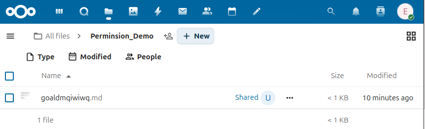

- Seguidament iniciem sessió com *Editor*, on es poden modificar documents però no eliminar-los si no són propis.  
- Seguidament veiem a la part de "Files", la carpeta que vam compartir i veuras que podem modificar documents però no eliminar-los si no són propis.

# Administració d’arxius a Nextcloud

## Organització de carpetes i fitxers

### Objectiu
Crear una jerarquia lògica de carpetes per mantenir els documents ordenats.

### Crear l’estructura de carpetes
**Instruccions (en anglès):**
1. Log in to your Nextcloud account.  
2. Go to **Files**.  
3. Click **+ New folder**.  
4. Create the following folders:  
   - **Documents Personals**  
   - **Treball Compartit**  
   - **Recursos**  
5. Open **Treball Compartit** and create subfolders:  
   - **Equip A**  
   - **Equip B**
   
## Polítiques de seguretat

### Objectiu
Activar opcions de seguretat com la caducitat dels enllaços compartits i l’obligació de contrasenya.

### Activar polítiques de seguretat
**Instruccions (en anglès):**
1. Log in as **admin**.  
2. Go to **Settings → Administration → Sharing**.  
3. Enable:  
   - **"Enforce expiration date for public links"**  
   - **"Enforce password protection for public links"**  
   - Optional: **"Allow users to share via link"**

### 2.2 Crear un enllaç compartit amb restriccions
**Instruccions (en anglès):**
1. Go to **Files**.  
2. Select a folder and click **Share**.  
3. Enable **Share link**.  
4. Set:  
   - An expiration date  
   - A password  
5. Test the link in another browser.

---

## 3. Accés des de qualsevol màquina de la xarxa

### 3.1 Obtenir la IP de la màquina virtual
- A Linux VM: `ip a`
- A Windows VM: `ipconfig`
  
### 3.2 Accedir a Nextcloud des d’una altra màquina

**Instruccions (en anglès):**
1. Open a browser on another device connected to the same network.  
2. Enter: `http://<IP-de-la-MV>/nextcloud`
3. Inicia sesió amb les teves credencials

### 3.3 Permetre accés al firewall (si és necessari)

**Instruccions (en anglès):**
- `sudo ufw allow 80/tcp`
- `sudo ufw allow 443/tcp`
## 4. (Extra) Accés a clouds de companys

### Objectiu
Afegir comptes externs de Nextcloud i navegar-hi.

### Afegir comptes externs
**Instruccions (en anglès):**
1. Log in to your Nextcloud.  
2. Go to **Settings → Connected Accounts**.  
3. Click **Add Nextcloud account**.  
4. Enter the server URL, username and app password.  
5. Save.

### Navegar pels comptes externs
**Instruccions (en anglès):**
1. Go to **Files**.  
2. Look for the new external folder.  
3. Open it to browse shared files.
